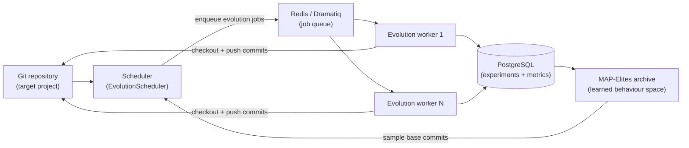
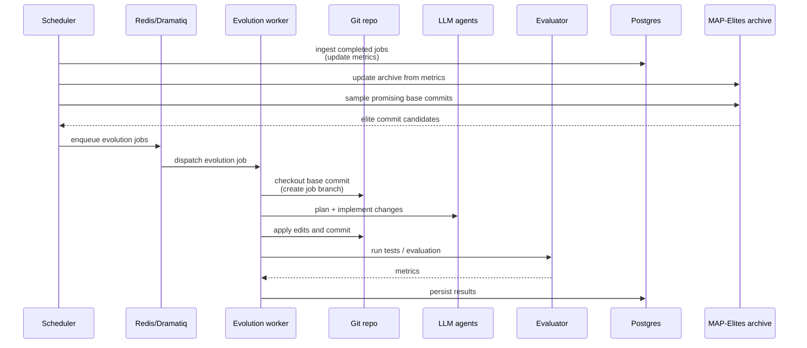

## Loreley

> Whole-repository MAP-Elites for real git codebases.

Loreley is an automated MAP-Elites system that **evolves entire git repositories**, not just single files or scripts. It continuously samples promising commits, asks external agents to plan and implement changes, evaluates them, and archives the best-performing and most diverse variants for later reuse.

Loreley is inspired by systems such as [AlphaEvolve](https://deepmind.google/blog/alphaevolve-a-gemini-powered-coding-agent-for-designing-advanced-algorithms/) and open-source efforts like [OpenEvolve](https://github.com/algorithmicsuperintelligence/openevolve), but is designed from day one for **whole-repo evolution**, a **learned behaviour space**, and a **production-grade distributed loop**.

---

### Why Loreley?

Most existing LLM-driven evolution systems are powerful research prototypes, but they struggle when pointed at real production repositories:

- **Single-file focus** – they typically optimise one script or entrypoint at a time, making it hard to express refactors that span multiple modules, configurations, and tests.
- **Hand-crafted behaviour features** – diversity is defined by manually designed descriptors, which often need to be rethought for every new project and may miss important behavioural axes.
- **Non-distributed or demo-oriented loops** – orchestration is usually a bespoke script rather than a resilient, distributed-native job system.

Loreley addresses these limitations with three core ideas:

- **Whole-repo evolution** – each individual in the search is a real git commit. The evolution worker checks out a clean worktree, applies cross-file changes (including new files and configs), runs evaluation, and produces a debuggable commit that works with normal tooling (git, CI, code review).
- **Learned behaviour space** – instead of hand-picking behaviour descriptors, Loreley learns them from code and summary embeddings (optionally reduced with PCA). Behavioural diversity is measured directly in this learned space, so the same pipeline can generalise across very different repositories.
- **Production-grade distributed loop** – a Dramatiq/Redis worker fleet, PostgreSQL-backed archive, and a central scheduler provide a long-running evolution loop that can scale out horizontally, respect resource limits, and cleanly export strong candidates as git branches.

Related systems include [AlphaEvolve](https://deepmind.google/blog/alphaevolve-a-gemini-powered-coding-agent-for-designing-advanced-algorithms/), [OpenEvolve](https://github.com/algorithmicsuperintelligence/openevolve), and [ShinkaEvolve](https://github.com/SakanaAI/ShinkaEvolve). Loreley focuses specifically on **whole-repository, production-grade evolution**.

---

### System overview

At a high level, Loreley sits between your git repository, a pool of LLM-based agents, and a MAP-Elites archive:



- **Scheduler**: keeps the experiment in sync with the repository, ingests completed jobs, samples new base commits from the MAP-Elites archive, and enqueues evolution jobs.
- **Workers**: for each job, check out a base commit, call external planning/coding/evaluation agents, create a new commit, and persist metrics.
- **Archive**: stores a diverse set of high-performing commits in a learned behaviour space, which the scheduler uses to inspire the next round of jobs.

---

### Evolution loop

The core evolution loop connects the scheduler, workers, git repository, evaluation plugins, and the MAP-Elites archive:



This loop can run indefinitely against a long-lived repository, gradually populating the MAP-Elites archive with diverse, high-quality commits.

---

### Architecture at a glance

Loreley is organised into a few main areas:

- **Configuration (`loreley.config`)** – a single `Settings` object (pydantic-settings) centralises environment-driven configuration for logging, database, Redis/Dramatiq, scheduler, worker repositories, and MAP-Elites knobs.
- **Database (`loreley.db`)** – SQLAlchemy engine/session helpers plus ORM models for repositories, experiments, commits, metrics, evolution jobs, and archive state.
- **Experiments (`loreley.core.experiments`)** – helpers for normalising the target git worktree into a `Repository`, deriving an `Experiment` from MAP-Elites and evaluator settings, and reusing the same experiment across scheduler runs.
- **MAP-Elites core (`loreley.core.map_elites`)** – preprocessing, chunking, code and summary embeddings, dimensionality reduction, archive management, sampling, and snapshot persistence via `MapElitesManager`.
- **Worker pipeline (`loreley.core.worker`)** – worktree lifecycle, planning, coding, evaluation, evolution commits, commit summaries, and job persistence used by Dramatiq actors.
- **Tasks (`loreley.tasks`)** – Redis broker helpers and the `run_evolution_job(job_id)` Dramatiq actor that runs the evolution worker.
- **Scheduler (`loreley.scheduler`)** – `EvolutionScheduler` ingests completed jobs into MAP-Elites, dispatches pending jobs, maintains a seed population (when a root commit is configured), and can create a best-fitness branch when an experiment reaches its job cap.
- **Operational scripts (`script/run_scheduler.py`, `script/run_worker.py`)** – CLI shims that wire up Loguru/Rich logging, settings, the Redis broker, and the scheduler/worker entrypoints.
- **Docs (`docs/`)** – focused guides for configuration, scheduler behaviour, worker operations, and the MAP-Elites pipeline.

Module-level documentation lives under `docs/loreley/**` and `docs/script/**`. The rendered site is built with MkDocs into `site/`.

---

### Requirements & tooling

- Python 3.11+
- [`uv`](https://github.com/astral-sh/uv) for dependency management
- PostgreSQL and Redis (Dramatiq broker)
- Git (worktrees, LFS optional)
- Access to configured external planning/coding/evaluation agents

---

### Quick start

#### 1. Clone and install

```bash
git clone <YOUR_FORK_OR_ORIGIN_URL> loreley
cd loreley
uv sync          # install dependencies from pyproject.toml / uv.lock
```

If you already have an environment, you can pin dependencies without creating a workspace:

```bash
uv sync --no-workspace
```

#### 2. Configure

All runtime settings come from environment variables consumed by `loreley.config.Settings`. Common examples:

- **Core app**
  - `APP_NAME`
  - `APP_ENV` (environment name, for example `development` / `staging` / `production`)
  - `LOG_LEVEL` (Loguru and Dramatiq log level)
- **Database**
  - `DATABASE_URL`
  - or individual `DB_SCHEME`, `DB_HOST`, `DB_PORT`, `DB_USER`, `DB_PASSWORD`, `DB_NAME`, `DB_POOL_SIZE`, `DB_MAX_OVERFLOW`, `DB_POOL_TIMEOUT`, `DB_ECHO`
- **Task queue / Dramatiq**
  - `TASKS_REDIS_URL` or (`TASKS_REDIS_HOST`, `TASKS_REDIS_PORT`, `TASKS_REDIS_DB`, `TASKS_REDIS_PASSWORD`)
  - `TASKS_REDIS_NAMESPACE`, `TASKS_QUEUE_NAME`
  - `TASKS_WORKER_MAX_RETRIES`, `TASKS_WORKER_TIME_LIMIT_SECONDS`
- **Scheduler**
  - `SCHEDULER_REPO_ROOT`
  - `SCHEDULER_POLL_INTERVAL_SECONDS`
  - `SCHEDULER_MAX_UNFINISHED_JOBS`, `SCHEDULER_MAX_TOTAL_JOBS`
  - `SCHEDULER_SCHEDULE_BATCH_SIZE`, `SCHEDULER_DISPATCH_BATCH_SIZE`, `SCHEDULER_INGEST_BATCH_SIZE`
- **Worker repository**
  - `WORKER_REPO_REMOTE_URL`, `WORKER_REPO_BRANCH`, `WORKER_REPO_WORKTREE`
  - `WORKER_REPO_ENABLE_LFS`, `WORKER_REPO_FETCH_DEPTH`, `WORKER_REPO_JOB_BRANCH_PREFIX`, `WORKER_REPO_JOB_BRANCH_TTL_HOURS`
- **Worker planning / coding**
  - `WORKER_PLANNING_CODEX_*` and `WORKER_CODING_CODEX_*` options configuring the default Codex-based planning/coding backends
  - `WORKER_PLANNING_BACKEND` and `WORKER_CODING_BACKEND` optional dotted paths to custom agent backends that implement the same protocol as the default Codex CLI backend
- **Evaluator**
  - `WORKER_EVALUATOR_PLUGIN`, `WORKER_EVALUATOR_PYTHON_PATHS`
  - `WORKER_EVALUATOR_TIMEOUT_SECONDS`, `WORKER_EVALUATOR_MAX_METRICS`
- **Evolution objective**
  - `WORKER_EVOLUTION_GLOBAL_GOAL` – plain-language global objective shared across jobs
- **MAP-Elites**
  - `MAPELITES_EXPERIMENT_ROOT_COMMIT` – optional experiment root commit used for seeding
  - `MAPELITES_PREPROCESS_*`, `MAPELITES_CHUNK_*`, `MAPELITES_CODE_EMBEDDING_*`, `MAPELITES_SUMMARY_*`, `MAPELITES_SUMMARY_EMBEDDING_*`
  - `MAPELITES_DIMENSION_REDUCTION_*`, `MAPELITES_FEATURE_*`, `MAPELITES_ARCHIVE_*`, `MAPELITES_FITNESS_*`, `MAPELITES_SAMPLER_*`, `MAPELITES_SEED_POPULATION_SIZE`

See `docs/loreley/config.md` for the exhaustive list.

---

### Running Loreley

#### Scheduler loop

The scheduler drives ingestion, scheduling, dispatch, seeding, and archive maintenance:

```bash
uv run python script/run_scheduler.py        # continuous loop
uv run python script/run_scheduler.py --once # single tick

# or invoke the module directly
uv run python -m loreley.scheduler.main        # continuous loop
uv run python -m loreley.scheduler.main --once # single tick
```

See `docs/script/run_scheduler.md` and `docs/loreley/scheduler/main.md` for details on scheduler behaviour and configuration.

#### Worker process

A worker process consumes jobs from Dramatiq, applies planning/coding/evaluation, and pushes results back into the database:

```bash
uv run python script/run_worker.py
```

The worker configures Loguru/Rich logging, initialises the Redis broker defined in `loreley.tasks.broker`, imports `loreley.tasks.workers`, and launches a single-threaded Dramatiq worker bound to `TASKS_QUEUE_NAME`.

See `docs/script/run_worker.md`, `docs/loreley/core/worker/evolution.md`, and the other worker module docs under `docs/loreley/core/worker/` for deeper operational guidance.

---

### Documentation map

The full documentation lives under `docs/` and is rendered into `site/` via MkDocs. Useful entry points:

- `docs/index.md` – high-level overview and navigation.
- `docs/loreley/config.md` – global settings and environment variables.
- `docs/loreley/db/` – database engine/sessions and ORM models.
- `docs/loreley/core/map-elites/` – MAP-Elites pipeline (preprocessing, chunking, embeddings, dimensionality reduction, sampler, snapshots, and summary embeddings).
- `docs/loreley/core/worker/` – planning, coding, evaluator, evolution loop, commit summaries, job store, and worker repository.
- `docs/loreley/scheduler/main.md` – scheduler internals and configuration.
- `docs/loreley/tasks/` – Redis broker and Dramatiq actors.
- `docs/script/` – CLI wrappers for the scheduler and worker.

---

### Project layout

- `loreley/` – core services (`config`, `db`, `core/map_elites`, `core/worker`, `scheduler`, `tasks`).
- `script/` – CLI shims (`run_scheduler.py`, `run_worker.py`).
- `docs/` – module-level docs under `docs/loreley` and `docs/script`, rendered into `site/`.
- `pyproject.toml`, `uv.lock` – dependency definitions for `uv`.
- `examples/` – self-contained optimisation examples used for testing and demos.

---

### Examples

- **`examples/circle-packing`** – a geometric optimisation benchmark based on the classical
  [circle packing](https://en.wikipedia.org/wiki/Circle_packing) problem. The example defines:
  - a small standalone problem repository in `examples/circle-packing` with a `solution.py`
    that exposes `pack_circles(n: int = 26)` and returns `n` non-overlapping circles inside
    the unit square; the default instance uses `n = 26` and the objective is to maximise
    the sum of radii subject to the non-overlap and boundary constraints;
  - a companion evaluation environment in `examples/circle_packing_env` with an
    `evaluate.py` plugin that checks geometric validity (no overlap, inside bounds) and
    reports `sum_radii` (main objective), `packing_density`, and `num_circles`.

  You can wire this into the worker by pointing
  `WORKER_EVALUATOR_PYTHON_PATHS` at `examples/circle_packing_env` and setting
  `WORKER_EVALUATOR_PLUGIN=evaluate:plugin`, then letting MAP-Elites evolve better packings.

---

### License

See `LICENSE` for details.
