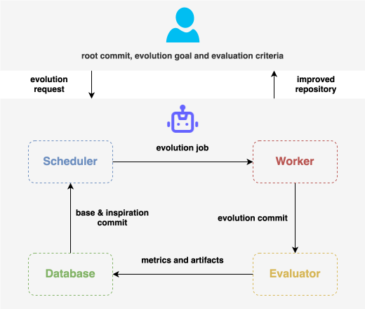
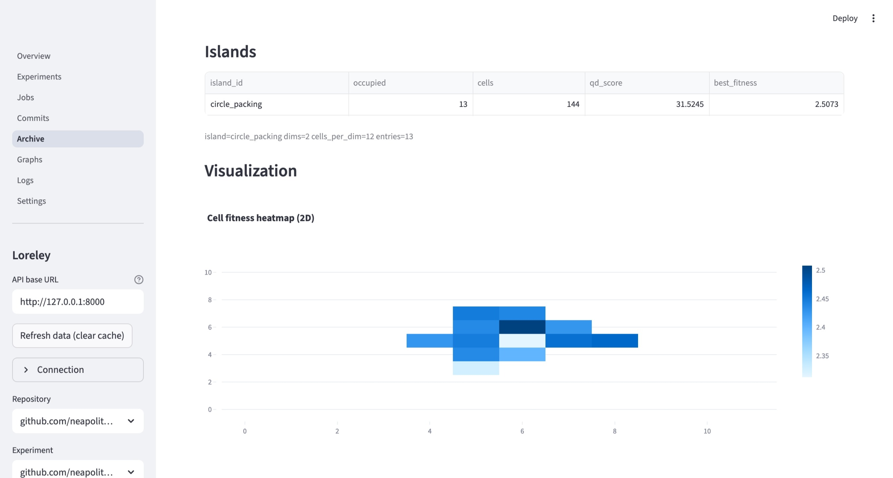

## Loreley

> Whole-repository Quality-Diversity optimization for real git codebases.

Loreley is a distributed system that **evolves entire git repositories** (the unit of search is a git commit). It continuously samples base commits, asks external planning and coding agents to implement repo-wide changes, evaluates the result with your evaluator, and stores metrics plus a MAP-Elites archive in Postgres for later sampling and reuse.



### Why use it

- **Whole-repo evolution**: cross-module refactors and “production-style” changes are first-class.
- **QD-native (MAP-Elites)**: keeps multiple high-performing but *different* solutions instead of a single champion line.
- **Learned behaviour space**: behaviour descriptors come from repo-state code embeddings (cached by git blob SHA), not hand-crafted heuristics.
- **Production loop**: scheduler + Redis/Dramatiq workers + Postgres, with preflight checks, logs, and reproducible git history.

### Quick start (local)

**Requirements**: Python 3.11+, [`uv`](https://github.com/astral-sh/uv), Git (worktrees), PostgreSQL, Redis, and an OpenAI-compatible API for embeddings and some summaries. Configure either a static `OPENAI_API_KEY` or a dynamic provider via `OPENAI_DYNAMIC_API_KEY_PROVIDER` plus `OPENAI_DYNAMIC_API_KEY_TTL_SECONDS`. You also need:

- **Planning/coding backend**: default is the Kilocode CLI (`kilo`) on `PATH` (override via `WORKER_PLANNING_BACKEND` / `WORKER_CODING_BACKEND`).
- **Evaluator plugin**: `WORKER_EVALUATOR_PLUGIN=module:callable` that runs unattended and returns structured metrics.

```bash
git clone <YOUR_FORK_OR_ORIGIN_URL> loreley
cd loreley
uv sync
docker compose up -d postgres redis

cp env.example .env
# Minimal required vars (in addition to defaults in env.example):
# - EXPERIMENT_ID=<uuid or slug>
# - SCHEDULER_MAX_TOTAL_JOBS=<positive integer>
# - OPENAI_API_KEY
#   or:
# - OPENAI_DYNAMIC_API_KEY_PROVIDER=module:callable
# - OPENAI_DYNAMIC_API_KEY_TTL_SECONDS=<positive integer>
# - MAPELITES_CODE_EMBEDDING_DIMENSIONS=<positive integer>
# - MAPELITES_EXPERIMENT_ROOT_COMMIT=<git commit hash>
# - WORKER_REPO_REMOTE_URL=<git remote URL with push access>
# - WORKER_EVALUATOR_PLUGIN=module:callable
#
# Recommended to customize:
# - WORKER_EVOLUTION_GLOBAL_GOAL="..."
#
# Optional:
# - SCHEDULER_REPO_ROOT=/abs/path/to/your/target-git-checkout
# - WORKER_KILOCODE_BIN=kilo
# - WORKER_KILOCODE_AGENT=<agent name>
# - WORKER_EVALUATOR_PYTHON_PATHS=["/abs/path/to/plugin_dir"]
# - SCHEDULER_STARTUP_APPROVE=true  # skip interactive startup approval

uv run loreley doctor --role all
uv run loreley scheduler
uv run loreley worker
uv run loreley status
```

### Optional UI and operator console

```bash
uv sync --extra ui
uv run loreley ui
```

Most UI pages are read-only. Operator actions such as job retry, baseline
ensure, and repair-pool updates require `LORELEY_API_WRITE_TOKEN` in the UI API
process and the Streamlit process.



### Documentation

- Local overview: [`docs/index.md`](docs/index.md)
- Online docs: [NeapolitanIcecream.github.io/loreley](https://NeapolitanIcecream.github.io/loreley/)
- Quickstart guides: [`docs/loreley/config.md`](docs/loreley/config.md), [`docs/script/run_scheduler.md`](docs/script/run_scheduler.md), [`docs/script/run_worker.md`](docs/script/run_worker.md)
- Operations: [`docs/script/status.md`](docs/script/status.md), [`docs/script/db.md`](docs/script/db.md), [`docs/script/jobs.md`](docs/script/jobs.md), [`docs/script/job_leases.md`](docs/script/job_leases.md), [`docs/script/config_dump.md`](docs/script/config_dump.md), [`docs/script/archive_stats.md`](docs/script/archive_stats.md)
- Upgrade notes: [`docs/releases/unreleased.md`](docs/releases/unreleased.md), [`docs/releases/v0.7.9-alpha.md`](docs/releases/v0.7.9-alpha.md), [`docs/releases/v0.7.8-alpha.md`](docs/releases/v0.7.8-alpha.md)
- Architecture decisions: [`docs/adr/index.md`](docs/adr/index.md)
