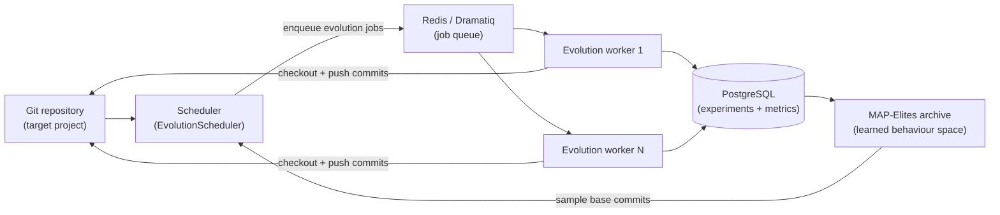
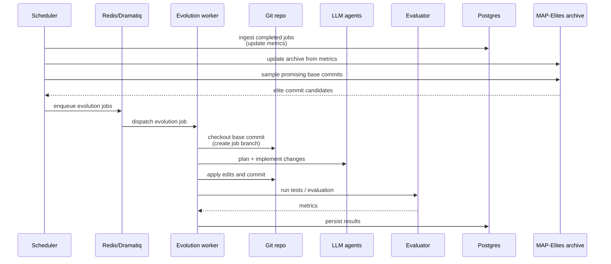

## Loreley

> Whole-repository MAP-Elites for real git codebases.

Loreley is an automated MAP-Elites system that **evolves entire git repositories**, not just single files or scripts. It continuously samples promising commits, asks external agents to plan and implement changes, evaluates them, and archives the best-performing and most diverse variants so they can be reused later.

If you are new to the project, start with the **core ideas** and **system overview** below, then follow the links into the focused module guides under `docs/loreley` and `docs/script`.

---

### Core ideas

Loreley is built around three key concepts:

- **Whole-repo evolution** – each individual in the search is a real git commit. The evolution worker operates on a full worktree, so changes can span multiple files, add new modules, or adjust configuration and tests, and the result remains a debuggable commit compatible with normal tooling (git, CI, code review).
- **Learned behaviour space** – instead of relying on hand-crafted behaviour descriptors, Loreley learns a behaviour space from code and summary embeddings (optionally reduced with PCA). Diversity is measured directly in this learned space, so the same pipeline can generalise across different repositories and problem domains.
- **Production-grade distributed loop** – a Dramatiq/Redis worker fleet, PostgreSQL-backed archive, and a central scheduler form a long-running, distributed evolution loop. Experiments are explicitly versioned, jobs are queued and retried, and strong candidates can be exported as git branches.

Related systems include [AlphaEvolve](https://deepmind.google/blog/alphaevolve-a-gemini-powered-coding-agent-for-designing-advanced-algorithms/), [OpenEvolve](https://github.com/algorithmicsuperintelligence/openevolve), and [ShinkaEvolve](https://github.com/SakanaAI/ShinkaEvolve). Loreley focuses specifically on **whole-repository, production-grade evolution**.

---

### System overview

At a high level, Loreley sits between your git repository, a pool of LLM-based agents, and a MAP-Elites archive:



- **Scheduler** keeps the experiment in sync with the repository, ingests completed jobs, samples new base commits from the MAP-Elites archive, and enqueues evolution jobs.
- **Workers** check out base commits, call external planning/coding/evaluation agents, create new commits, and persist metrics.
- **Archive** stores a diverse set of high-performing commits in a learned behaviour space that the scheduler uses to inspire the next round of jobs.

---

### Evolution loop

The core evolution loop connects the scheduler, workers, git repository, evaluation plugins, and the MAP-Elites archive:



This loop can run indefinitely against a long-lived repository, gradually populating the MAP-Elites archive with diverse, high-quality commits.

---

### Architecture map

Loreley is split into a few key areas:

- **Configuration** – `loreley.config.Settings` centralises environment-driven configuration for logging, database, Redis/Dramatiq, scheduler, worker repositories, and MAP-Elites knobs.  
  See: [Configuration](loreley/config.md)
- **Database** – `loreley.db` defines the SQLAlchemy engine/session helpers and ORM models for repositories, experiments, jobs, metrics, and archive state.  
  See: [DB base](loreley/db/base.md), [DB models](loreley/db/models.md)
- **Experiments & repositories** – `loreley.core.experiments` normalises the target git worktree into a `Repository`, derives an `Experiment` from MAP-Elites and evaluator-related settings, and exposes helpers for reusing the same experiment ID across scheduler runs.  
  See: [Experiments](loreley/core/experiments.md)
- **MAP-Elites core** – `loreley.core.map_elites` handles preprocessing, chunking, embeddings, dimensionality reduction, archive management, sampling, and snapshots.  
  See: [MAP-Elites overview](loreley/core/map-elites/map-elites.md) and the linked sub-pages below.
- **Worker pipeline** – `loreley.core.worker` manages worktrees, planning, coding, evaluation, evolution commits, and commit summaries.  
  See: worker module pages under `loreley/core/worker/`.
- **Scheduler** – `loreley.scheduler.main.EvolutionScheduler` runs the ingest → dispatch → measure → schedule loop that keeps the archive and job store in sync.  
  See: [Scheduler](loreley/scheduler/main.md)
- **Tasks & scripts** – `loreley.tasks` exposes the Dramatiq broker and actors, while `script/run_scheduler.py` and `script/run_worker.py` are CLI wrappers.  
  See: [Tasks broker](loreley/tasks/broker.md), [Tasks workers](loreley/tasks/workers.md), [Running the scheduler](script/run_scheduler.md), [Running the worker](script/run_worker.md)

---

### Getting started

Use this section as a quick operational checklist; see the README for more detail.

#### Requirements

- Python 3.11+
- [`uv`](https://github.com/astral-sh/uv) for dependency management
- PostgreSQL and Redis
- Git (including worktrees; LFS optional)

#### Install dependencies

```bash
git clone <YOUR_FORK_OR_ORIGIN_URL> loreley
cd loreley
uv sync          # install dependencies from pyproject.toml / uv.lock
```

If you already have an environment, you can pin dependencies without creating a workspace:

```bash
uv sync --no-workspace
```

#### Configure Loreley

All runtime configuration is provided via environment variables and loaded by `loreley.config.Settings`. Common examples:

- `APP_NAME`, `ENVIRONMENT`, `LOG_LEVEL`
- `DATABASE_URL` (or individual `DB_*` fields)
- `TASKS_REDIS_URL` / `TASKS_REDIS_HOST` / `TASKS_REDIS_PORT` / `TASKS_REDIS_DB` / `TASKS_REDIS_PASSWORD` / `TASKS_REDIS_NAMESPACE`
- `TASKS_QUEUE_NAME`, `TASKS_WORKER_MAX_RETRIES`, `TASKS_WORKER_TIME_LIMIT_SECONDS`
- `SCHEDULER_*` and `WORKER_REPO_*` settings for the scheduler and worker repositories
- `MAPELITES_*` settings for preprocessing, embeddings, dimensionality reduction, bounds, archive, fitness, and sampling

See [Configuration](loreley/config.md) for the exhaustive list.

#### Run the scheduler

The scheduler drives ingestion, scheduling, dispatch, and archive maintenance:

```bash
uv run python script/run_scheduler.py        # continuous loop
uv run python script/run_scheduler.py --once # single tick
```

See [Running the scheduler](script/run_scheduler.md) and [Scheduler internals](loreley/scheduler/main.md) for more detail.

#### Run the worker

A worker process consumes jobs from Dramatiq, applies planning/coding/evaluation, and pushes results back into the database:

```bash
uv run python script/run_worker.py
```

See [Running the worker](script/run_worker.md) and the worker module pages under `loreley/core/worker/` for operational and implementation details.

---

### Documentation map

Use this index as a quick map of the rest of the documentation:

- **Configuration**
  - [Global settings](loreley/config.md)
- **Database**
  - [Engine and sessions](loreley/db/base.md)
  - [ORM models](loreley/db/models.md)
- **Experiments**
  - [Repository & experiment helpers](loreley/core/experiments.md)
- **MAP-Elites core**
  - [Overview & archive](loreley/core/map-elites/map-elites.md)
  - [Preprocessing](loreley/core/map-elites/preprocess.md)
  - [Chunking](loreley/core/map-elites/chunk.md)
  - [Code embeddings](loreley/core/map-elites/code_embedding.md)
  - [Dimensionality reduction](loreley/core/map-elites/dimension_reduction.md)
  - [Sampler](loreley/core/map-elites/sampler.md)
  - [Snapshots](loreley/core/map-elites/snapshot.md)
  - [Summary embeddings](loreley/core/map-elites/summarization_embedding.md)
- **Worker pipeline**
  - [Planning agent](loreley/core/worker/planning.md)
  - [Coding agent](loreley/core/worker/coding.md)
  - [Evaluator](loreley/core/worker/evaluator.md)
  - [Evolution loop](loreley/core/worker/evolution.md)
  - [Commit summaries](loreley/core/worker/commit_summary.md)
  - [Job store](loreley/core/worker/job_store.md)
  - [Worker repository](loreley/core/worker/repository.md)
- **Scheduler & tasks**
  - [Scheduler](loreley/scheduler/main.md)
  - [Tasks broker](loreley/tasks/broker.md)
  - [Tasks workers](loreley/tasks/workers.md)
- **Operational scripts**
  - [Run scheduler script](script/run_scheduler.md)
  - [Run worker script](script/run_worker.md)

---

### Next steps

- Start by configuring a small test repository and running the scheduler/worker pair locally.
- Once the basic loop works, plug in a custom evaluator (for example, based on the circle packing example) and tune `MAPELITES_*` settings.
- When you are ready for production, point the scheduler at a long-lived repository clone and supervise both processes with your preferred process manager.
