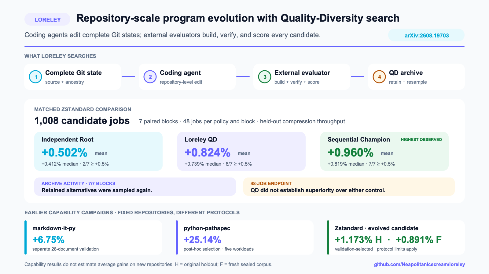
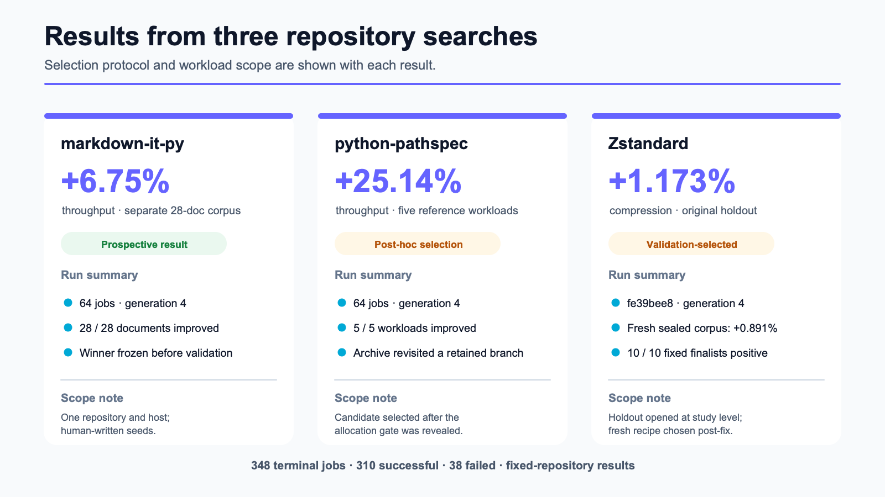
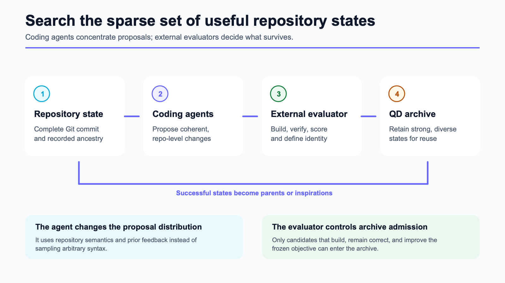

# Loreley

> Quality-Diversity program search over complete Git repositories.

Loreley uses planning and coding agents to propose repository-level commits. A
project-specific evaluator builds, verifies, and scores each candidate.
Candidates that pass may enter a persistent Quality-Diversity archive and
remain available as parents or inspirations for later jobs.

A Git commit records the source state and its ancestry. For compiled or
generated targets, the evaluator can define a separate measurement identity,
such as a release-binary hash, so equivalent artifacts do not consume another
benchmark run.

[Evidence](#evidence) · [How it works](#how-loreley-works) ·
[Paper](https://arxiv.org/abs/2608.19703) ·
[Run Loreley](#run-loreley) ·
[Design partners](marketing/loreley-design-partner-brief.md)



The paper, [*Loreley: Repository-Scale Program Evolution with
Quality-Diversity Search*](https://arxiv.org/abs/2608.19703), reports the system,
three capability campaigns, and a matched Zstandard experiment comparing
Loreley QD with Sequential Champion and Independent Root search. The controlled
experiment used seven paired blocks and 48 physical candidate jobs per policy
and block, for 1,008 jobs in total. At 48 jobs, neither comparison established
a QD advantage. Read the [PDF](https://arxiv.org/pdf/2608.19703) or inspect the
[public experiment record](https://github.com/NeapolitanIcecream/loreley/blob/main/paper/evidence/zstd_method_efficacy.json).

## Evidence

### Matched policy comparison

The matched experiment compared Loreley QD, Sequential Champion, and
Independent Root on the same Zstandard revision. At the 48-job endpoint, QD
was 0.135% below Sequential Champion (95% BCa interval −0.556% to +0.161%) and
0.320% above Independent Root (−0.082% to +0.686%). Neither contrast
established a QD advantage. The archive did retain and later resample
non-incumbent states, separating observed mechanism activity from the endpoint
result.

### Three repository searches

Three earlier campaigns completed 348 jobs: 310 succeeded and 38 failed. Each
study used a different workload and selection protocol, so the percentage
results should not be averaged or treated as expected performance on another
repository.



| Repository | Measured result | Selection status |
| --- | --- | --- |
| [`markdown-it-py`](research/2026-08-02-markdown-it-py-deepseek-case-study.md) | Throughput +6.75% on a separate 28-document corpus; 28/28 documents improved | Winner frozen before validation |
| [`python-pathspec`](research/2026-08-03-pathspec-deepseek-case-study.md) | Throughput +25.14% across five reference workloads; 5/5 improved | Post-hoc selection after the registered candidate failed its allocation gate |
| [Zstandard](research/2026-08-07-zstandard-gpt-v19-top10-validation-supplement.md) | Validation-selected generation-4 candidate: compression throughput +1.173% on the original holdout and +0.891% on a newly sealed corpus | Original holdout previously opened at study level; fresh-corpus recipe chosen after candidate fixation |

The [aggregate evidence report](research/2026-08-07-loreley-case-study-evidence-report.md)
contains the protocols, costs, failure counts, candidate selection records, and
claim limits for all three studies.

## How Loreley works



1. **Define a campaign.** Fix the root commit, optimization goal, protected
   scope, evaluator, objectives, and job budget.
2. **Propose repository changes.** The scheduler selects retained commits as
   bases or inspirations. Planning and coding agents edit isolated Git
   worktrees and produce new commits.
3. **Evaluate each candidate.** The project evaluator builds the candidate,
   applies correctness and scope gates, measures the configured objectives, and
   may report an artifact identity.
4. **Retain useful states.** Loreley stores the commit, ancestry, metrics,
   artifacts, and terminal outcome. Passing candidates may enter the
   Quality-Diversity archive and be sampled by later jobs.

The evaluator controls what constitutes a valid improvement. It may call local
scripts, a C or C++ build, a Java benchmark, a container, a hardware testbed,
or a remote evaluation service. The evaluator plugin has a Python interface;
the target repository can use any implementation language.

## Quality-Diversity over repository states

Loreley derives behaviour descriptors from repository-state code embeddings.
File embeddings are cached by Git blob SHA, aggregated into commit vectors,
and can be reduced with PCA before placement in a MAP-Elites grid. Each occupied
cell retains a bounded Pareto front over the configured objectives.

Configured islands maintain separate archives and can exchange retained
candidates as inspirations. This keeps multiple valid branches available when
they occupy different behavioural niches or represent different objective
trade-offs.

The three capability studies show multi-generation lineages, archive
retention, and later reuse of retained branches. The paper's separate matched
experiment did not establish that Quality-Diversity outperforms
root-independent sampling or sequential editing of a single champion at its
48-job horizon.

| Concern | Representation in Loreley |
| --- | --- |
| Reproducible source state | Complete Git commit |
| Candidate ancestry | Parent and inspiration edges between commits |
| Measurement identity | Evaluator-defined artifact, such as a binary, container image, or trace |
| Behavioural diversity | Repository-state embeddings and MAP-Elites cells |
| Multiple objectives | Bounded per-cell Pareto fronts |
| Persistent execution | PostgreSQL state, Redis/Dramatiq queues, schedulers, and worker processes |

## When a repository is a fit

A campaign needs:

- unattended build and correctness checks;
- at least one numerical objective with a known direction;
- an evaluator whose runtime and noise are compatible with the effect size of
  interest;
- enough safe evaluation parallelism for the proposed job budget;
- an isolated repository mirror, build environment, and authorized model
  access; and
- enough engineering or business value to justify repeated model calls and
  evaluations.

The [design-partner brief](marketing/loreley-design-partner-brief.md) describes
evaluator calibration, candidate identity, data separation, budget planning,
and the non-confidential intake process.

## Run Loreley

Loreley is alpha software. A campaign requires Python 3.11+, Git worktrees,
PostgreSQL, Redis, the Kilocode CLI or another configured agent backend, an
OpenAI-compatible embedding endpoint, and an unattended evaluator plugin.

```bash
git clone https://github.com/NeapolitanIcecream/loreley.git
cd loreley
uv sync
docker compose up -d postgres redis
cp env.example .env
```

Configure the experiment ID, root commit, job cap, target repository remote,
evaluator plugin, embedding settings, objectives, and islands in `.env`. See
the [configuration guide](loreley/config.md) for the complete contract.

Run the preflight checks, then start the scheduler and workers in separate
shells:

```bash
uv run loreley doctor --role all
uv run loreley scheduler
uv run loreley worker --processes 4
uv run loreley status
```

Before dispatching a new campaign, the scheduler scans the configured root
commit and requests operator approval. Non-interactive deployments can use
`--yes` or `SCHEDULER_STARTUP_APPROVE=true` after reviewing the scan settings.

The optional operator console is available with:

```bash
uv sync --extra ui
uv run loreley ui
```

## Documentation and evidence

| Resource | Contents |
| --- | --- |
| [Paper: arXiv:2608.19703](https://arxiv.org/abs/2608.19703) ([PDF](https://arxiv.org/pdf/2608.19703)) | Method, matched 1,008-job experiment, capability studies, and limitations |
| [Configuration](loreley/config.md) | Campaign, evaluator, model, archive, and runtime settings |
| [Scheduler](script/run_scheduler.md) and [worker](script/run_worker.md) guides | Starting and operating a campaign |
| [Three-case evidence report](research/2026-08-07-loreley-case-study-evidence-report.md) | Results, costs, failures, and evidence boundaries |
| [Candidate diff index](marketing/candidates/README.md) | Published source patches and artifact identities |
| [English essay](marketing/2026-08-loreley-launch-article-en.md) | Repository search model and the three capability studies |
| [中文文章](marketing/2026-08-loreley-launch-article-zh.md) | 《用编码智能体搜索真实代码仓库》 |
| [Architecture decisions](adr/index.md) | Accepted design records |
| [Release notes](releases/v0.10.0-alpha.md) | Current alpha release |

## Status and scope

The current release is `v0.10.0-alpha`. The three capability studies
demonstrate the end-to-end system on their frozen repositories and evaluators.
They do not estimate Loreley's success rate or average effect on a new
repository. The matched experiment covers one Zstandard revision, one host,
and a 48-job horizon per policy and block.

Loreley is licensed under the
[Apache License 2.0](https://github.com/NeapolitanIcecream/loreley/blob/main/LICENSE).

## Citation

```bibtex
@misc{chen2026loreley,
  title         = {Loreley: Repository-Scale Program Evolution with Quality-Diversity Search},
  author        = {Mohan Chen},
  year          = {2026},
  eprint        = {2608.19703},
  archiveprefix = {arXiv},
  primaryclass  = {cs.SE},
  url           = {https://arxiv.org/abs/2608.19703}
}
```

Machine-readable metadata are available in
[`CITATION.cff`](https://github.com/NeapolitanIcecream/loreley/blob/main/CITATION.cff).
