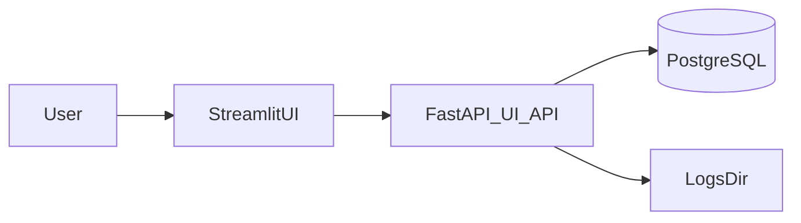

## UI overview

Loreley ships an **optional** visualization stack designed for read-only observability:

- **FastAPI UI API**: a small, versioned JSON API that reads from PostgreSQL (and optionally the local `logs/` directory).
- **Streamlit UI**: a multipage dashboard that calls the API and renders tables (native `st.dataframe` with row selection; optional AgGrid fallback) and charts (Plotly), plus an interactive commit graph (NetworkX + PyVis embedded via `st.components.v1.html`).

The UI is intentionally read-only: it does not enqueue jobs, stop workers, or mutate the database.



## Install

The UI dependencies live under the `ui` extra in `pyproject.toml`.

```bash
uv sync --extra ui
```

## Run

Start the API first:

```bash
uv run python script/run_api.py
```

Then start Streamlit:

```bash
uv run python script/run_ui.py --api-base-url http://127.0.0.1:8000
```

You can also run Streamlit directly:

```bash
uv run streamlit run loreley/ui/app.py
```

## Configuration

### UI variables

- `LORELEY_UI_API_BASE_URL`: Base URL for the UI API (default: `http://127.0.0.1:8000`).

### API runtime variables

The API relies on the standard Loreley settings (database/logs), see `docs/loreley/config.md`.

Common ones:

- `DATABASE_URL` (or individual `DB_*` fields)
- `LOGS_BASE_DIR` (optional; logs are read from `<LOGS_BASE_DIR>/logs` or `<cwd>/logs`)

## Pages

- **Overview**: quick KPIs (loaded jobs, failures), fitness trend (from commit lineage), island table.
- **Experiments**: experiment list and selected experiment config snapshot; island overview.
- **Jobs**: job table with filters and a details panel (payload).
- **Commits**: commit table with search; commit details with metrics chart.
- **Archive**: island stats, snapshot metadata, record scatter/heatmap, record table.
- **Graphs**: fitness scatter + interactive commit lineage graph (PyVis).
- **Logs**: browse role logs and tail a file.
- **Settings**: API health and safe settings (`Settings.export_safe()`).

## API endpoints (v1)

Base prefix: `/api/v1`

- `GET /health`
- `GET /repositories`
- `GET /repositories/{repository_id}/experiments`
- `GET /experiments/{experiment_id}`
- `GET /jobs`
- `GET /jobs/{job_id}`
- `GET /commits`
- `GET /commits/{commit_hash}`
- `GET /archive/islands`
- `GET /archive/records`
- `GET /archive/snapshot_meta`
- `GET /graphs/commit_lineage`
- `GET /logs`
- `GET /logs/tail`

## Notes

- **Caching**: the Streamlit UI caches API GET calls (default: ~60s); use the sidebar **Refresh data** button to clear cache.
- **Security**: there is no authentication layer. Deploy behind your internal network controls if exposing remotely.


