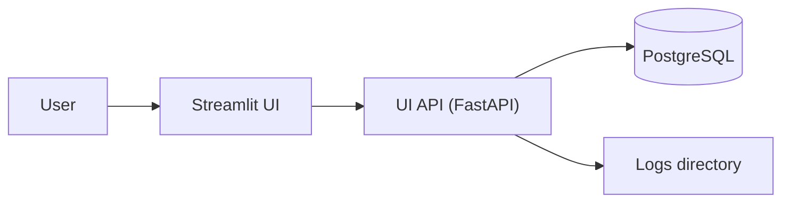

# Streamlit UI (loreley.ui)

Loreley ships an optional Streamlit dashboard for observability and local
operator actions. It calls the [UI API](api.md) and renders tables, charts, and
commit lineage graphs.

Most pages are read-only. The operator pages can create baseline ensure tasks
and retry failed or stale jobs. These writes require the API bearer token configured with
`LORELEY_API_WRITE_TOKEN`. In the Streamlit UI, each operator write button stays
disabled until its matching confirmation checkbox is checked for that action.


```mermaid
flowchart LR
  user[User] --> stApp[Streamlit UI]
  stApp --> api["UI API (FastAPI)"]
  api --> db[(PostgreSQL)]
  api --> logsDir[Logs directory]
```

## Install

The UI dependencies live under the `ui` extra in `pyproject.toml`.

```bash
uv sync --extra ui
```

## Run

When the UI API is not running and `LORELEY_UI_API_BASE_URL` (or `--api-base-url`)
points to a local HTTP URL (`http://127.0.0.1:<port>`, `http://localhost:<port>`,
or `http://[::1]:<port>`), starting the UI will automatically start the UI API in
a subprocess.

You can still start the API manually:

```bash
uv run loreley api
```

Start Streamlit:

```bash
uv run loreley ui --api-base-url http://127.0.0.1:8000
```

See also:

- [Running the UI API](../script/run_api.md)
- [Running the Streamlit UI](../script/run_ui.md)

## Configuration

### UI variables

- `LORELEY_UI_API_BASE_URL`: Base URL for the UI API (default: `http://127.0.0.1:8000`).

### API runtime variables

The API relies on standard Loreley settings (database/logs). See:

- [Configuration](config.md)
- [UI API](api.md)

## Pages

The Streamlit UI is multi-page (implemented under `loreley/ui/pages`):

- **Overview**: quick KPIs, primary-objective trend, island/Pareto table.
- **Campaign**: campaign program sections, warnings, active/current hash
  comparison, baseline status, and baseline ensure background tasks.
- **Jobs**: job table with status, kind, fate, and evidence filters; single-job
  retry and bulk failed-stale retry.
- **Commits**: commit table with search, fate/evidence indicators, and commit
  details with charts.
- **Archive**: island stats, snapshot metadata, record plots, fate/evidence
  indicators, and baseline delta when available.
- **Graphs**: primary-objective scatter and commit lineage graph with fate and
  agent-visible evidence counts.
- **Logs**: browse role logs and tail a file.
- **Settings**: API health and safe settings (`Settings.export_safe()`).

## Notes

- **Caching**: the Streamlit UI caches API GET calls (default: ~60s); use the sidebar **Refresh data** button to clear cache. Write actions clear the cache before rerunning the page.
- **Operator write confirmations**: Campaign baseline ensure and Jobs retry
  actions require their own checkbox confirmation before the write button is
  enabled.
- **Security**: UI API write routes require `LORELEY_API_WRITE_TOKEN`; the
  Streamlit process sends it on POST requests when the variable is set. Deploy
  the UI and API behind trusted local or internal network controls.
