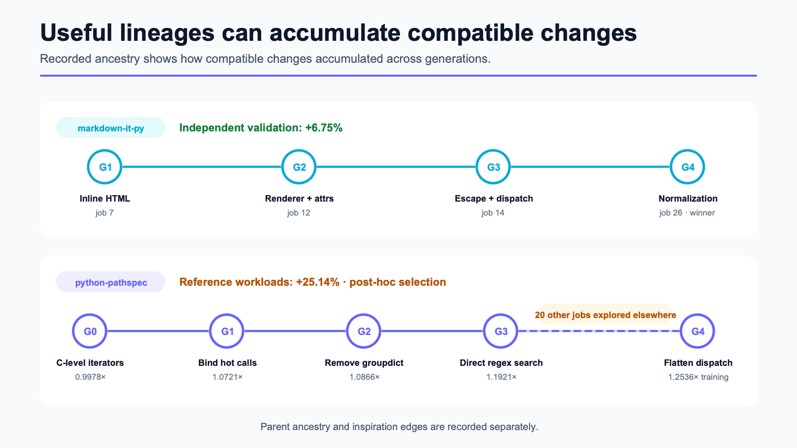
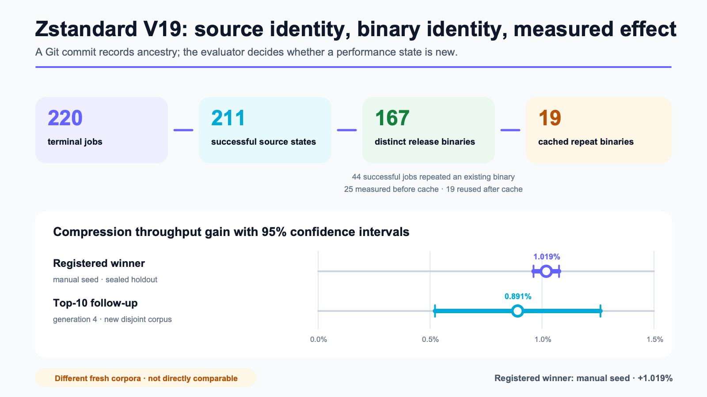

# Searching Real Code Repositories with Coding Agents

*Results from 348 Loreley jobs on `markdown-it-py`, `python-pathspec`, and Zstandard*

The accompanying paper, [*Loreley: Repository-Scale Program Evolution with
Quality-Diversity Search*](https://arxiv.org/abs/2608.19703)
([PDF](https://arxiv.org/pdf/2608.19703)), also reports a later 1,008-job
controlled comparison of three search policies.

Loreley performs evaluator-guided search over complete Git repositories. Planning and coding agents propose changes in isolated worktrees. A project-specific evaluator builds the result, applies correctness gates, and measures the configured objectives. Candidates that pass may enter a distributed quality-diversity archive and serve as parents or inspirations for later jobs.

A Git commit records the source state and its ancestry. For compiled or generated projects, the evaluator can provide a separate artifact identity, such as a release-binary hash, so that equivalent artifacts do not consume additional measurement budget.

We evaluated Loreley on fixed revisions of three repositories. The studies completed 348 jobs: 310 succeeded and 38 failed.

| Repository | Search budget | Active run time | Measured result | Selection status |
| --- | ---: | ---: | --- | --- |
| `markdown-it-py` | 64 jobs | 4.35 hours | throughput +6.75% | candidate frozen before validation |
| `python-pathspec` | 64 jobs | 3.91 hours | throughput +25.14% | post-hoc selection after allocation failure |
| Zstandard | 220 jobs | 5.31 runner-hours | validation-selected generation-4 candidate: +1.173% on the original holdout; +0.891% on a newly sealed corpus | split-specific qualifications below |

The studies used different workloads and selection protocols. Their percentage results should not be averaged or treated as estimates of performance on other repositories.


## Search model and evaluator

The space of possible repository states is large. The states that build, pass the required tests, stay within the permitted edit scope, and improve the objective are sparse. Coding agents use the existing implementation, tests, names, types, call sites, profiles, and previous results to propose concrete commits. The evaluator determines which of those commits satisfy the experiment contract.

Each job starts from a commit retained by the search. A planning agent inspects the goal, repository, and earlier results. A coding agent edits an isolated Git worktree and creates a commit. The evaluator then builds, tests, and measures that worktree.


Evaluators use a small Python interface. The following simplified plugin returns a throughput measurement and the identity of the tested artifact:

```python
from loreley.core.worker.evaluator import EvalFail, EvalPass


def evaluate(context):
    result = build_test_and_benchmark(context.worktree)
    if not result.tests_passed:
        return EvalFail(kind="test", summary=result.failure)

    return EvalPass(
        summary="tests passed; benchmark completed",
        metrics={
            "name": "throughput",
            "value": result.throughput,
            "unit": "items/s",
            "higher_is_better": True,
        },
        candidate_identity=f"release-binary:{result.binary_sha256}",
    )
```

`build_test_and_benchmark()` may invoke a shell script, C or C++ build, Java benchmark, container, hardware testbed, or remote service. The Python interface does not restrict the implementation language of the target project.

Passing candidates are placed in a quality-diversity archive. The archive retains several high-performing candidates in different behavioral niches instead of maintaining only one incumbent. A later job can continue one retained lineage and receive an implementation from another lineage as inspiration.

## Case study 1: `markdown-it-py`

The `markdown-it-py` study used 64 jobs: 8 human-written seeds and 56 evolution jobs. The final candidate was frozen before the validation corpus was opened. On a separate corpus of 28 documents, it improved geometric-mean throughput by 6.75%. All 28 documents improved.

The final patch accumulated four generations of changes:

1. reduce string slicing in inline HTML parsing;
2. modify renderer dispatch and token-attribute hot paths;
3. reduce HTML-escaping and dispatch overhead;
4. add a normalization fast path.

The resulting diff changed five files, with 54 lines added and 14 removed. Each generation passed the evaluator before it became the parent of the next generation. The candidate was frozen before validation, so its selection was prospective. The four commits record compatible optimizations accumulating across generations.

## Case study 2: `python-pathspec`

The `python-pathspec` study used 64 jobs: 6 human-written seeds and 58 evolution jobs. The lineage that produced the reported candidate began at 0.9978× the root throughput. Later generations reached 1.0721×, 1.0866×, 1.1921×, and 1.2536× on the training workload.

The changes bound calls used in the hot loop, removed `groupdict()`, precomputed regular expressions, invoked `search()` directly, and flattened dispatch into pre-bound matcher tuples. Twenty jobs explored other candidates between generations 3 and 4. The archive retained the lineage during that interval.



The final candidate improved throughput by 25.14% across five reference workloads. All five workloads improved, and the candidate passed the correctness, semantic, edit-scope, and allocation gates.

Candidate selection was post-hoc. The registered training winner failed the larger allocation shape used in reference evaluation, and the reported candidate was selected after that result was known. The 25.14% measurement applies to the five reference workloads, but it is not a prospective holdout result.

The experiment records the archive retaining the 0.9978× lineage and sampling it again in a later job. It does not compare quality-diversity with a single-champion or root-independent search under an equal budget.

## Case study 3: Zstandard

The Zstandard study used 220 jobs: 8 human-written seeds and 212 evolution jobs. Expanded validation of the fixed training Top 10 selected generation-4 candidate `fe39bee8`. It improved compression throughput by 1.234% on validation (95% CI +1.156% to +1.312%), by 1.173% on the original holdout (+1.102% to +1.245%), and by 0.891% on a newly generated and sealed corpus (+0.522% to +1.261%). Compressed size was unchanged on all four measured splits.

The four-generation lineage combined a zero-literal fast path, a compression hot-path change, and an eight-byte histogram update unroll. Its [source patch](candidates/zstandard-v19-evolved-followup.patch) changes three files, with 33 insertions and 16 deletions.

The split history matters. The original protocol validated only the training Top 3 and selected manual seed `7b9aef38`, which later measured +1.019% on the then-sealed holdout. When expanded validation selected `fe39bee8`, its own original-holdout score was still unknown, but the corpus had already been opened at study level. The fresh-corpus recipe and seed were chosen after `fe39bee8` was fixed, and the resulting data were generated and sealed before measurement. The original-holdout result is therefore candidate-level out-of-selection evidence rather than an untouched study-level holdout; the fresh result uses sealed data whose construction was chosen after candidate fixation.

A [fixed-Top-10 follow-up](../research/2026-08-07-zstandard-gpt-v19-top10-validation-supplement.md) provides a separate sensitivity check. Candidate identities and order were fixed before nine additional original-holdout measurements. All ten candidates were positive, with a median gain of 1.116% and point estimates from +0.856% to +1.239%. Generation-3 candidate `5ee53426` had the highest descriptive lower-bound ranking at +1.228% (95% CI +1.125% to +1.330%), while `fe39bee8` measured +1.173%. The intervals overlap; this post-selection ranking does not replace the validation-selected candidate.

Of the 211 successful jobs, 167 produced distinct release binaries and 44 reproduced a binary that had already appeared. The evaluator used the release-binary SHA-256 for measurement identity, while Git commits retained source ancestry. After caching was enabled, 19 repeated binaries reused an accepted report; their median evaluator time was 21.6 seconds, compared with 186.7 seconds for jobs that ran the benchmark.



## Resource accounting

The reported active times sum to 13.57 hours. The reports use slightly different campaign-time and active-runner definitions. These figures exclude experiment preparation, human analysis, and external waiting time.

The `markdown-it-py` and `python-pathspec` proxy logs yield generation-cost estimates of $2.0833 and $2.4856 under the recorded public pricing version, for a combined estimate of $4.5689. The records contain no provider bill. Embeddings, hosts, and human work were not priced.

The Zstandard study recorded a $60.2472 Kilo model-catalog estimate rather than a provider invoice. Its accounting basis differs from the two DeepSeek costs, so the three dollar figures should not be summed as an all-in project cost.

The expanded Top-10 validation, fresh-corpus measurement, and nine new original-holdout measurements used 120.6 minutes of local evaluation after the search. They made no model calls and added no model tokens.

The [aggregate evidence report](../research/2026-08-07-loreley-case-study-evidence-report.md) contains the complete metrics, failure categories, token records, and selection status. The [candidate index](candidates/README.md) contains the four published source diffs.

## Relation to prior work

[FunSearch](https://www.nature.com/articles/s41586-023-06924-6) combined language-model generation, executable evaluation, and a database of previous programs within a human-provided program skeleton. [AlphaEvolve](https://arxiv.org/abs/2506.13131) expanded the editable code and supported multiple objectives and expensive external evaluation. Google later [reported](https://deepmind.google/blog/alphaevolve-impact/) that an AlphaEvolve-discovered Spanner LSM compaction heuristic reduced write amplification by 20%. In July 2026, Google [made AlphaEvolve available through Google Cloud](https://blog.google/innovation-and-ai/infrastructure-and-cloud/google-cloud/alphaevolve-on-cloud/).

Repository-scale systems published in 2025 and 2026 include:

- [SATLUTION](https://arxiv.org/abs/2509.07367), which modified a large C/C++ SAT solver over 70 cycles and ran each solver revision on 400 benchmark instances, or about 28,000 solver-instance executions;
- [ABCEvo](https://arxiv.org/abs/2604.15082), which connected agents to a million-line electronic-design-automation codebase with compilation, benchmark flows, and formal-equivalence checks;
- [CodeEvolve](https://arxiv.org/abs/2605.04677), which used runtime profiles to select optimization targets in Java and Apex;
- [HORIZON](https://arxiv.org/abs/2606.28279), which used Git worktrees and executable acceptance protocols to retain accepted engineering traces.

Loreley uses complete Git commits for source and ancestry, evaluator-defined artifact identities for measurement, and a distributed quality-diversity archive for parent and inspiration selection. Loreley's three studies used 348 physical jobs. SATLUTION reports about 28,000 solver-instance executions; the units provide scale context but are not normalized candidate or compute budgets.

## Evidence scope and the controlled comparison

Across the three studies, Loreley generated and evaluated cross-file repository changes, and candidates passed independent performance evaluation. None of the studies compared quality-diversity search with simpler strategies under an equal budget.

Recent work reports that [independent sampling or sequential rewriting can match more elaborate search](https://arxiv.org/abs/2602.16805) on some code-evolution tasks. A separate [analysis of evolution traces](https://arxiv.org/abs/2605.20086) attributes some reported improvements to parameter tuning, reintroduced code, or evaluator overfitting.

A later matched experiment reported in the [Loreley
paper](https://arxiv.org/abs/2608.19703) held the planning and coding GPT
routes, evaluator, and attempted candidate-job budget fixed across three
strategies:

1. independent candidates sampled from the root;
2. sequential edits to the current champion;
3. Loreley's quality-diversity archive for parent and inspiration selection.

The experiment used seven paired blocks and 48 physical candidate jobs per
policy and block, for 1,008 jobs in total. At 48 jobs, QD was 0.135% below
Sequential Champion (95% BCa interval −0.556% to +0.161%) and 0.320% above
Independent Root (−0.082% to +0.686%). Neither contrast established a QD
advantage. Archive retention and later sampling did occur: four of seven final
QD winners had a non-incumbent state in their primary-parent ancestry under the
paper's retrospective one-incumbent rule. Counting inspiration edges raised
that number to six, without establishing that the supplied context caused an
edit.

Further work includes longer search horizons, Zstandard replication on x86-64,
and a preregistered finalist policy that covers Top 10, an effect band, or
adaptive racing.

## Integration requirements

Repository language is not the main constraint. A suitable evaluator must:

- build and run correctness checks without manual intervention;
- measure the target objective with known noise and runtime;
- define an identity for the artifact that consumes measurement budget;
- run with enough safe parallelism for the intended search budget.

Potential targets include compression and storage systems, database execution paths, compilers and EDA, SAT/SMT solvers, inference serving, and internal performance-critical code. The value of an expected improvement must justify the model and evaluation cost.

The [design-partner brief](loreley-design-partner-brief.md) lists the measurements needed to scope a run. Loreley is [available on GitHub](https://github.com/NeapolitanIcecream/loreley).
